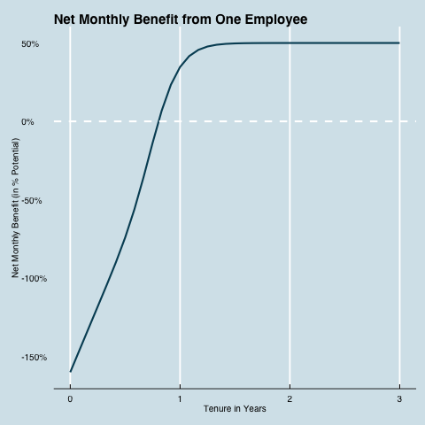

Employee Churn 201: Calculating Employee Value
==============================================

Welcome to the GitHub outpost of the [recent Predictive Analytics Times article](http://www.talentanalytics.com) by Pasha Roberts from [Talent Analytics](http://www.talentanalytics.com).

Our goal here is to foster conversation and learning, including learning by us.
In the article, we put out a stylized model of employee value, plotting out monthly employee costs and benefits:


## The Quantitative Scissors
In the blog, we define the way that these costs operate, to show why high attrition cause is costly to an employer.
We remark that this model acts as a "quantitative scissors" that define our options to reduce the damage done by attrition, to these choices:

- Decrease hiring/onboarding costs
- Decrease time to full productivity
- Decrease salary/productivity ratio
- Increase overall productivity (which is at odds with all above points)
- Decrease employee turnover prior to the full productivity phase
- Hire to increase the proportion of employees who are likely to "survive" to the full productivity phase

To support this bold claim, we are publishing the code for the model, for your own experimentation in R.
While it could be done in excel, spreadsheets run out of analytics fuel quickly, and are not nearly as transparent as the attached code.

## Playing with Models

To use this code, either download the single `blog001.R` file, or use the `Download ZIP` button, or best of all, use git to clone the project.
Only with the last option will you be able to submit


```R
max.yrs <- 3		# max number of years to show on plot
max.benefit <- 1.5	# year at which employee delivers fully-trained value (asymptote) 

cost.ramp <- 1.5	# higher numbers speed up time before costs = salary
cost.scale <- 3		# higher numbers increase height of original training costs
salary <- 0.5		# monthly salary as a percent of fully trained value delivered to company
```

## The Lost Plots

Also, you can view here two plots that did not make it in to the paper:




